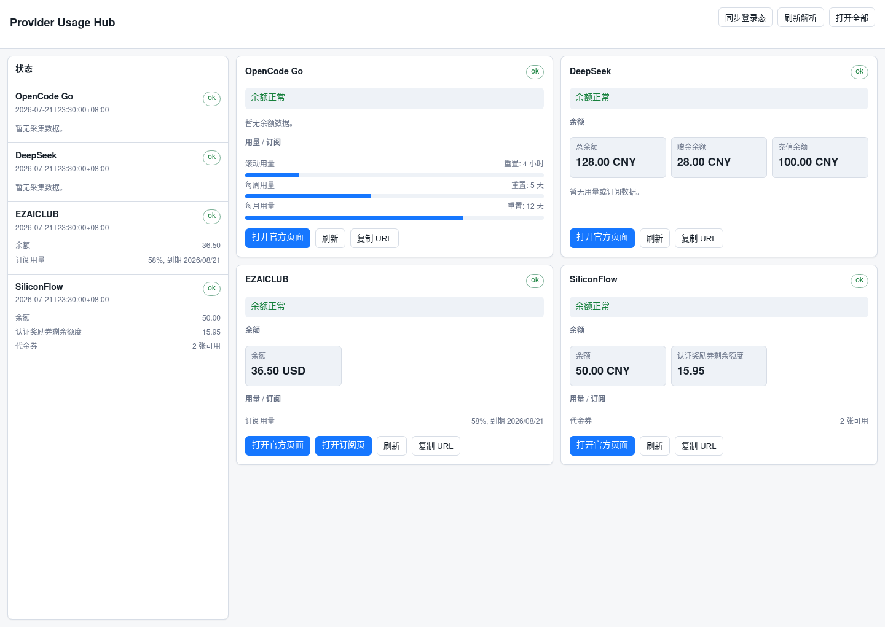

# Provider Usage Hub

本地 provider 余额和用量聚合看板。当前内置：

- OpenCode Go: `https://opencode.ai/workspace/wrk_01KW9MTABWQ0DNJ014CV528WC2/go`
- DeepSeek: `https://platform.deepseek.com/usage`
- EZAICLUB: `https://www.ezaiclub.com/dashboard` 和 `https://www.ezaiclub.com/subscriptions`
- SiliconFlow: `https://cloud.siliconflow.cn/me/expensebill?tab=coupon`

看板会展示可解析到的余额、用量、订阅和券信息，并保留官方页面按钮用于充值或查看详情。



## 运行 Web 看板

安装 Playwright：

```bash
UV_CACHE_DIR=/tmp/uv-cache uv pip install playwright
```

DeepSeek 余额使用官方 API，需要配置 API Key：

```bash
export DEEPSEEK_API_KEY=sk-...
```

启动服务：

```bash
uv run python server.py 19765
```

打开：

```text
http://127.0.0.1:19765
```

页面包含：

- “同步登录态”：把 BrowserOS 登录态同步到后端抓取 profile。
- “刷新解析”：按 provider 顺序刷新所有数据。
- Provider 卡片上的“刷新”：只刷新当前 provider。
- “打开全部”：一次打开所有 provider 主页面。
- 官方页面按钮和“复制 URL”按钮。

## BrowserOS 登录态

OpenCode、EZAICLUB 和 SiliconFlow 的后端解析需要 BrowserOS profile 副本。推荐先在 BrowserOS 里登录相关站点，然后在看板点击“同步登录态”，同步完成后再刷新 provider。

手动同步 fallback：

```bash
cp -r /home/cv/.config/browser-os /home/cv/.browseros-crawler-profile
rm -f /home/cv/.browseros-crawler-profile/Singleton*
```

BrowserOS 关闭时同步最干净。官方页面按钮不依赖这个副本，会直接使用你当前浏览器自己的登录态。

## 配置

默认不需要配置即可运行。需要改 URL、profile 或禁用 provider 时：

```bash
cp providers.example.json providers.local.json
```

然后编辑 `providers.local.json`。

本地文件不会提交：

- `providers.local.json`
- `.provider-cache.json`
- `result.json`
- `dumps/`

## CLI

列出 provider：

```bash
uv run python crawler.py --list-providers
```

刷新单个 provider：

```bash
uv run python crawler.py --provider siliconflow
```

刷新所有 provider：

```bash
uv run python crawler.py --all
```

探索登录后页面文本：

```bash
uv run python crawler.py --provider ezaiclub --explore
```

## 输出

- `result.json`: CLI 最近一次输出。
- `.provider-cache.json`: Web/API 最近一次成功或失败快照。
- `dumps/{provider}.txt`: parser 无法识别字段时的探索文本。

## 浏览器插件版

当前仓库同时包含 Chrome/Edge Manifest V3 插件实现。加载扩展时请选择 `extension/` 目录，不要选择仓库根目录。

```text
/home/cv/crash-crawler/extension
```

插件版不需要启动 `server.py`，也不需要同步 BrowserOS profile。它会直接使用当前浏览器的登录态访问 provider 页面；DeepSeek API Key 在扩展设置页中保存到 `chrome.storage.local`。

用户可以自行新增普通页面型 provider，不需要改插件源代码：打开扩展设置页，点击“添加页面 Provider”，再编辑模板里的 URL 和 `parserRules`。也可以直接在“高级 JSON 配置”里添加 `type: "page"` provider，通过 `parserRules` 配置余额、额度和文本指标解析规则：

```json
{
  "id": "example-page",
  "name": "Example",
  "type": "page",
  "targetUrl": "https://example.com/dashboard",
  "enabled": true,
  "secondaryUrls": [{ "label": "打开订阅页", "url": "https://example.com/subscriptions" }],
  "parserRules": {
    "loginHints": ["Login", "Sign in", "登录"],
    "readyPattern": "余额|用量|后重置",
    "balances": [
      { "label": "余额", "pattern": "^[$](\\d+(?:\\.\\d+)?)$", "valueGroup": 1, "currency": "USD", "limit": 1 }
    ],
    "quotas": [
      {
        "label": "每周用量",
        "pattern": "^[$](\\d+(?:\\.\\d+)?)\\s*/\\s*[$](\\d+(?:\\.\\d+)?)$",
        "usedGroup": 1,
        "limitGroup": 2,
        "currency": "USD",
        "resetPattern": "(.+?)\\s*后重置"
      }
    ],
    "textMetrics": [
      { "label": "到期时间", "pattern": "剩余\\s*[^()]*\\(([^)]+)\\)", "valueGroup": 1 }
    ]
  }
}
```

本地回归测试：

```bash
npm test
```
