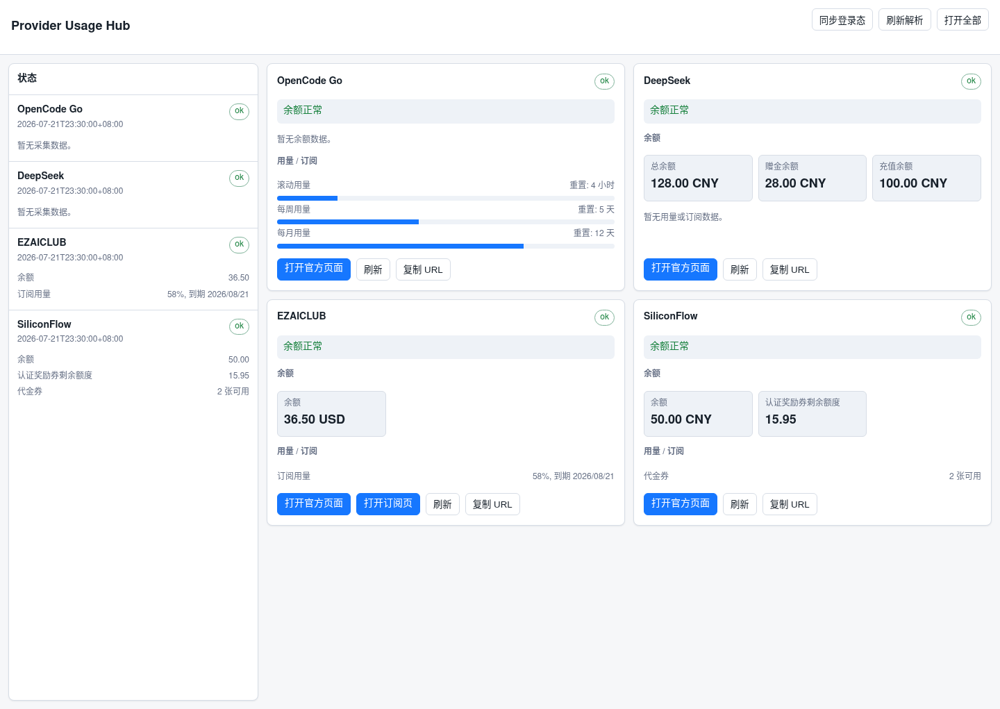

# Provider Usage Hub

本地 provider 余额和用量聚合看板。内置的官方 Provider 包括：

- OpenCode Go: `https://opencode.ai/workspace/wrk_01KW9MTABWQ0DNJ014CV528WC2/go`
- DeepSeek: `https://platform.deepseek.com/usage`
- SiliconFlow: `https://cloud.siliconflow.cn/me/expensebill?tab=coupon`

看板会展示可解析到的余额、用量、订阅和券信息，并保留官方页面按钮用于充值或查看详情。



## 运行 Web 看板

首次运行时创建项目虚拟环境并安装 Python 依赖：

```bash
UV_CACHE_DIR=/tmp/uv-cache uv venv .venv
UV_CACHE_DIR=/tmp/uv-cache uv pip install -r requirements.txt
```

启动服务：

```bash
uv run python server.py 19765
```

也可以使用启动脚本。首次运行会自动创建 `.venv` 并安装依赖：

```bash
./launch.sh
```

传入端口即可覆盖默认的 `19765`：

```bash
./launch.sh 19766
```

如果刷新时提示 Playwright 未安装，先确认 `uv run` 使用的是项目虚拟环境：

```bash
uv run python -c 'import sys, playwright; print(sys.executable); print(playwright.__file__)'
```

输出的解释器路径应位于项目的 `.venv/`。如果依赖已经安装但页面仍显示旧错误，请停止此前由 `python3 server.py 19765` 启动的进程，再使用上面的 `uv run python server.py 19765` 重新启动服务。Provider 的旧错误状态会在下一次刷新成功后被覆盖。

打开后可使用三个页面：

```text
http://127.0.0.1:19765/          Provider 看板
http://127.0.0.1:19765/channels  最低倍率可用渠道
http://127.0.0.1:19765/settings  Provider 与刷新设置
```

Provider 看板包含：

- “同步登录态”：把 BrowserOS 登录态同步到后端抓取 profile。
- “刷新全部”：一次并行刷新（API 并行，同 profile 的浏览器抓取复用同一 BrowserOS 实例）。
- 刷新期间可取消；任务进度会写入本地 `.refresh-job.json`，服务重启后会将未完成任务标记为中断并保留结果。
- 全量刷新出现失败 Provider 时，主页面可使用“重试失败”只重新采集失败项。
- Provider 卡片上的“刷新”：只刷新当前 provider。
- “打开全部”：一次打开所有 provider 主页面。
- 按用户配置的分组和顺序展示余额、额度、订阅指标及错误状态。
- 自动、全部、单 Provider 和渠道刷新共享同一个刷新协调器，不会同时争用浏览器会话或覆盖快照。

渠道页汇总 Sub2API 类渠道监控数据，按模型筛选当前可用渠道，并按实际倍率从低到高排序。实际倍率为 `渠道显示倍率 / 充值比例`；例如充值比例为 `1:10`，Provider 的 `recharge_ratio` 配置为 `10`。列表同时显示最近状态时间线、延迟和 7 天可用率，可选择包含降级渠道。
渠道刷新使用独立后台任务，支持进度、取消、失败项重试，并在服务重启后保留中断状态和已完成结果。

设置页支持：

- 新增、编辑、启用、停用和删除 Provider。
- 设置分组、批量移动 Provider，并用上下按钮调整整体顺序。
- 导入、导出 Provider JSON；可选择“合并”或“替换”，完成后显示新增、更新、未变化和删除数量。密钥不会进入导出文件。
- 配置本地服务的自动刷新间隔，默认关闭。
- 在 DeepSeek Provider 编辑器内保存或清除本地 API Key。也可继续使用 `DEEPSEEK_API_KEY` 环境变量，环境变量优先。
- 添加通用页面 Provider，以插件兼容的 `secondaryUrls` 和 `parserRules` JSON 配置多页面 CSS/正则解析。

扩展设置页的“本地 Web 同步”支持从本地服务预览并拉取配置，或将扩展配置预览并推送到本地服务。配对令牌在 Web 设置页生成，可轮换；同步地址仅允许本机回环地址。应用同步时会校验配置 revision，预览后如果另一侧发生变化会拒绝覆盖。本地 Web 的所有写接口都要求当前配对令牌，内置页面会自动附加；自行调用 API 时需发送 `X-Provider-Sync-Token` 请求头。服务端同时拒绝非回环地址的 `Host` 请求。

设置保存后，已经打开的 Provider 和渠道页面会自动重新读取配置；标签页重新获得焦点时也会检查最新分组和顺序。

## BrowserOS 登录态

需要页面登录态的后端解析依赖 BrowserOS profile 副本。推荐先在 BrowserOS 里登录相关站点，然后在看板点击“同步登录态”，同步完成后再刷新 provider。

手动同步 fallback：

```bash
cp -r /home/cv/.config/browser-os /home/cv/.browseros-crawler-profile
rm -f /home/cv/.browseros-crawler-profile/Singleton*
```

BrowserOS 关闭时同步最干净。“打开主页”按钮不依赖这个副本，会直接使用你当前浏览器自己的登录态。

## 配置

默认不需要配置即可运行。推荐直接通过设置页管理。也可以从示例文件开始手工配置：

```bash
cp providers.example.json providers.local.json
```

然后编辑 `providers.local.json`。

本地文件不会提交：

- `providers.local.json`
- `.provider-cache.json`
- `.provider-secrets.json`
- `result.json`
- `dumps/`

本地 Web 支持官方 API、浏览器采集、Sub2API 类渠道和通用 `page` Provider。插件导出的通用页面 Provider 可以直接导入；当前网页自动识别、访问页面触发刷新、工具栏角标属于扩展运行时能力，不适用于本地服务。

扩展和本地 Web 共用 [`schemas/provider-config-v4.schema.json`](schemas/provider-config-v4.schema.json) 定义的 portable v4 配置。两端运行时都会检查 v4 的字段形状，业务校验再额外检查 URL、正则和解析规则安全性；高于当前支持范围的 schema 版本会明确拒绝，避免按旧规则误读未来配置。导入接受单个 Provider、Provider 数组或 `{ "providers": [...] }`；导出统一使用 camelCase。`refreshOnVisit` 等扩展字段会由本地 Web 保留并重新导出，即使本地采集不使用该字段。空的可选选择器和暂未配置解析规则的通用页面允许导入，刷新时会在 Provider 状态中提示缺少可采集指标。

“合并”会按 ID 更新已存在的 Provider 并追加新 Provider，其他配置保持不变；“替换”会删除导入文件中不存在的 Provider。扩展执行替换时仍会保留内置 Provider。

## CLI

列出 provider：

```bash
uv run python crawler.py --list-providers
```

刷新单个 provider：

```bash
uv run python crawler.py --provider siliconflow
```

刷新所有 provider：

```bash
uv run python crawler.py --all
```

探索登录后页面文本：

```bash
uv run python crawler.py --provider PROVIDER_ID --explore
```

## 输出

- `result.json`: CLI 最近一次输出。
- `.provider-cache.json`: Web/API 最近一次成功或失败快照。
- `dumps/{provider}.txt`: parser 无法识别字段时的探索文本。

## 浏览器插件版

当前仓库同时包含 Chrome/Edge Manifest V3 插件实现。加载扩展时请选择 `extension/` 目录，不要选择仓库根目录。

```text
/home/cv/crash-crawler/extension
```

加载步骤：

1. 打开 `chrome://extensions/` 或 `edge://extensions/`。
2. 开启“开发者模式”。
3. 点击“加载已解压的扩展程序”，选择上面的 `extension/` 目录。
4. 更新代码后，在扩展管理页点击“重新加载”。

插件版不需要启动 `server.py`，也不需要同步 BrowserOS profile。它会直接使用当前浏览器的登录态访问 provider 页面；DeepSeek API Key 在编辑内置 DeepSeek Provider 时配置，并独立保存到 `chrome.storage.local`。

### Provider 管理

用户可以自行新增 provider，不需要改插件源代码：

- 点击“新增来源”，填写名称、页面 URL，并按需添加余额、额度或文本指标。
- NewAPI 和 Sub2API 可使用设置页中的专用模板创建，不需要手写解析规则。
- 每个指标使用 CSS 选择器取值，可以选择元素属性和匹配序号；额度支持从同一元素读取 `$50.15 / $50.00`，也支持分别选择已用值和总额。
- 点击“测试”直接预览余额、额度、文本和逐规则诊断，测试不会写入正式快照。
- 保存或测试新域名时，浏览器会申请对应站点的访问权限。
- 已授予的可选站点权限会保留，避免多个设置页同时保存时出现权限申请与回收竞态；如需撤销，请在浏览器的扩展站点权限设置中操作。
- 内置 provider 可改名称、主页 URL 和附加页面（例如 OpenCode workspace），解析类型不可改；也可复制成自定义来源。“导入 Provider 配置”和“导出”用于分享 JSON 配置。批量导入会整体校验，不会只导入其中一部分。
- 编辑 Provider 时可以填写分组。设置页支持多选 Provider 后批量移动或新建分组，也可重命名、删除分组；拖拽和上下箭头可调整 Provider 及整个分组的顺序。分组操作会立即保存，Popup 按保存顺序分组展示并支持折叠。默认只展开第一组，其他组折叠；可在全局设置中关闭“默认折叠 Provider 分组”。
- 刷新后工具栏角标会提示异常/建议充值数量；popup 打开时会跟随 storage 中的最新快照更新。
- Popup 执行“刷新全部”时可以取消；已完成的 Provider 会保留快照，排队中的 Provider 标记为已取消。
- Popup 检测到失败或过期快照时可“重试失败”，只重新采集异常 Provider。
- 设置页可配置后台自动刷新（默认每 30 分钟，可关）。默认只使用 API/HTTP 或复用已打开页面，不会静默创建后台标签页；也可显式选择“仅 API / HTTP”或允许后台标签页。
- 内置来源默认在用户访问对应站点时主动更新；自定义来源需在编辑器中显式启用“访问页面时自动更新”。监听页面的 content script 只发送访问通知，指标仍由后台按已验证的 CSS/正则规则解析。
- 部分内置 Provider 会优先使用站点内部 API，失败时再回退到页面 DOM 解析。
- SiliconFlow 优先走内部 API（页面 `SF_SUBJECT_ID` + `x-subject-id` 请求 `/walletd-server/.../wallets`），失败时再回退到页面 DOM 解析。
- 站点内部 API 所需的临时登录字段只短期缓存到 `chrome.storage.session`，按 provider 和 origin 隔离；不会写入持久化快照或日志，鉴权失败后会立即清除。
- 页面解析不会枚举站点的 `localStorage` 或 `sessionStorage`；内置 API 只读取明确需要的登录字段。
- 导入来源会限制页面数、规则数、正则复杂度和最长等待时间，异常配置会在保存前被拒绝。
- DeepSeek API Key 不属于 Provider JSON，不会随 Provider 配置导入或导出；编辑内置 DeepSeek Provider 时可更新或显式清除已保存的密钥。

### 从当前网页添加 Provider

在已登录的中转站页面打开插件，点击“添加到 Provider”即可检测当前站点：

- 当前支持自动识别 NewAPI 和 Sub2API。
- 插件只在用户点击后检测当前页面，不会在后台扫描所有标签页。
- 已存在的同域 Provider 不会重复添加；同域的通用页面 Provider 会原地升级，并保留 ID、名称、分组、充值比例、启用状态和访问时刷新设置。
- 识别为 Sub2API 时会同时读取初始余额快照和渠道数据。渠道接口暂时失败不会阻止添加，可在渠道页重新刷新。
- 未登录或无法识别的站点不会写入配置。

### 渠道倍率排行

Popup 主页面仍以 Provider 为主；点击“渠道”会打开独立的渠道页。该页面提供：

- 汇总所有支持渠道数据的已配置 Provider。
- 按模型筛选渠道，并默认按实际倍率从低到高排序。
- 展示当前状态、最近状态时间线、倍率来源和最近检查时间。
- 可选择是否包含降级渠道，也可只刷新支持渠道数据的 Provider。
- 渠道刷新期间显示逐 Provider 进度，可取消当前任务；失败后可只重试异常渠道 Provider，关闭再打开页面也会继续显示仍在运行的任务。
- 实际倍率按 `渠道显示倍率 / Provider 充值比例` 计算。例如充值比例为 `1:10` 时，配置 `rechargeRatio: 10`，显示倍率会再除以 10。

### Provider 配置格式

设置页不要求用户直接编辑 JSON。导出的 v4 Provider 格式示例：

```json
{
  "schemaVersion": 4,
  "id": "example-page",
  "name": "Example",
  "group": "常用",
  "type": "page",
  "targetUrl": "https://example.com/dashboard",
  "rechargeRatio": 1,
  "enabled": true,
  "refreshOnVisit": false,
  "secondaryUrls": [
    { "id": "subscriptions", "label": "订阅页", "url": "https://example.com/subscriptions" }
  ],
  "parserRules": {
    "loginHints": ["Login", "Sign in", "登录"],
    "readySelector": ".account-balance",
    "balances": [
      {
        "id": "balance-1",
        "pageId": "main",
        "label": "余额",
        "selector": ".account-balance",
        "attribute": "textContent",
        "index": 0,
        "currency": "USD"
      }
    ],
    "quotas": [
      {
        "id": "quota-1",
        "pageId": "subscriptions",
        "label": "每周用量",
        "mode": "combined",
        "selector": ".weekly-usage",
        "currency": "USD",
        "resetSelector": ".weekly-reset"
      }
    ],
    "textMetrics": [
      {
        "id": "text-1",
        "pageId": "subscriptions",
        "label": "到期时间",
        "selector": ".expires-at",
        "attribute": "textContent",
        "index": 0
      }
    ]
  }
}
```

旧版 v1-v3 配置仍可导入和运行；缺少 `group` 的 Provider 会进入“未分组”，缺少 `rechargeRatio` 时按 `1` 处理。CSS 选择器取得的文本需要进一步裁剪时，可以在指标的“正则提取”中填写正则和捕获组。

插件刷新策略：

- “刷新全部”按实际采集步骤调度：网络步骤和页面步骤使用独立并发池，不再静态地把 provider 分成 API/Page 两批。
- 每个 provider 完成后立即写入快照；刷新运行状态保存在 `chrome.storage.session`，Service Worker 重启后会跳过已完成来源、继续未完成来源并清理遗留标签页。
- 自动刷新默认禁止新建后台标签页；手动刷新仍允许完整的页面降级路径。
- 多页 Provider 会复用同一个后台标签页导航，避免每个 URL 都新建标签。
- 渲染等待依赖 ready 文本/选择器与稳定采样，不再叠加大段固定 sleep。
- 快照的 `raw.collection` 会记录各采集策略的成功/失败、耗时和 fallback 原因，并对 Token、Cookie、API Key 做脱敏。

回归测试：

```bash
npm test
uv run python -m unittest discover -p 'test_*.py'
```
